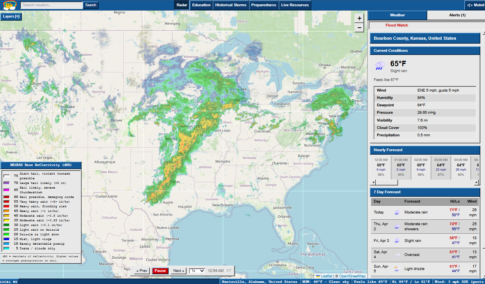

# weatherCenter

A weather radar app built to look and feel like the classic NWS weather.gov site. Real time NEXRAD radar, current conditions, alerts, forecasts, and a bunch of educational content about severe weather.



## What it does

- **Live radar** with animated NEXRAD reflectivity frames across the US
- **Current conditions** for any location worldwide (temperature, wind, humidity, pressure, the works)
- **NWS alerts** pulled straight from the National Weather Service API with color coded severity
- **GOES satellite imagery** (visible and infrared) from both GOES East and West
- **7 day forecast** and hourly breakdown when you click anywhere on the map
- **Weather education** section covering tornadoes, hurricanes, derechos, cloud types, radar signatures, and more
- **Historical storms** page with write ups on major events like the Tri State Tornado, Hurricane Katrina, and the 2011 Super Outbreak
- **Emergency preparedness** guides with supply lists, shelter info, and seasonal checklists
- **Live resources** linking to NWS, SPC, NHC, FEMA, and other official sources

## Tech stack

**Frontend**
- React + Vite
- Leaflet for the interactive map
- Tailwind CSS + inline styles for the retro Win95 bevel look
- React Query for data fetching

**Backend**
- Python FastAPI
- Proxies geocoding through Nominatim
- Pulls weather data from Open Meteo- Alerts come from the NWS API
- WebSocket support for live updates

**Data sources**
- NEXRAD radar via Iowa Environmental Mesonet WMS
- GOES satellite imagery via Iowa Environmental Mesonet WMS
- Weather data via Open Meteo API
- Alerts via NWS API (api.weather.gov)
- Geocoding via Nominatim

## Run locally

You'll need Node.js and Python 3.12+.

**Backend:**
```bash
cd backend
pip install -r requirements.txt
uvicorn app.main:app --reload --port 8000
```

**Frontend:**
```bash
cd frontend
npm install
npm run dev
```

The frontend dev server runs on port 3000 and proxies API requests to the backend on port 8000.

## Notes

- Radar and alerts are US focused (NEXRAD coverage + NWS API)
- Weather conditions work globally through Open Meteo
- All images in the education and historical sections are public domain (NOAA, NWS, NASA, FEMA) or Creative Commons, sourced through Wikimedia Commons
